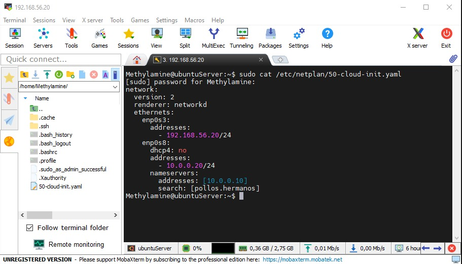
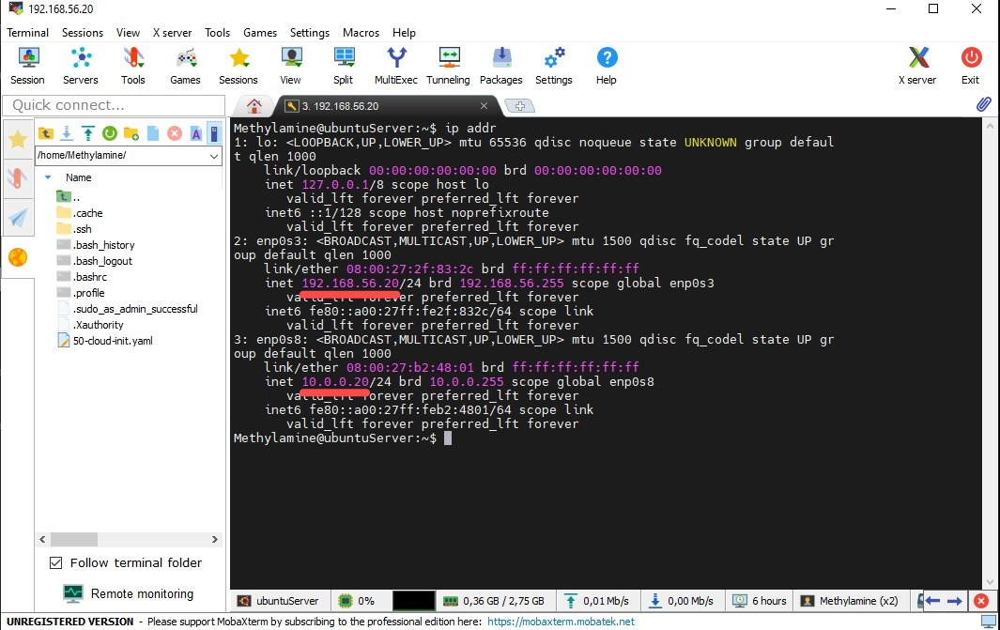

# 🧪 Nodo: Methylamine (Ubuntu Server)

Este servidor Linux actúa como el nodo de procesamiento del laboratorio, integrado en la red de "Pollos Hermanos".

## 🌐 Configuración de Red (Netplan)
El servidor utiliza una configuración de doble interfaz para separar el tráfico de gestión del tráfico de datos interno.

* **Interfaz de Gestión (enp0s3):** `192.168.56.20/24`
* **Interfaz Interna (enp0s4):** `10.0.0.20/24`
* **DNS:** Apunta a `10.0.0.10` (Blue-Sky) con dominio de búsqueda `pollos.hermanos`.

### Evidencia de Configuración
A continuación se muestra el archivo YAML de Netplan validando el direccionamiento estático:

## 📊 Estado de las Interfaces
Validación del estado de los enlaces y las IPs asignadas mediante el comando `ip addr`:

---
**Nota:** Se observa que ambas interfaces están en estado `UP`, garantizando la conectividad con el Controlador de Dominio y el acceso remoto vía SSH.
